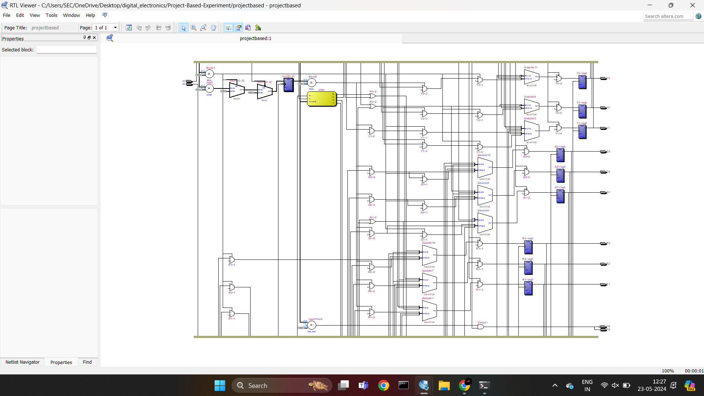
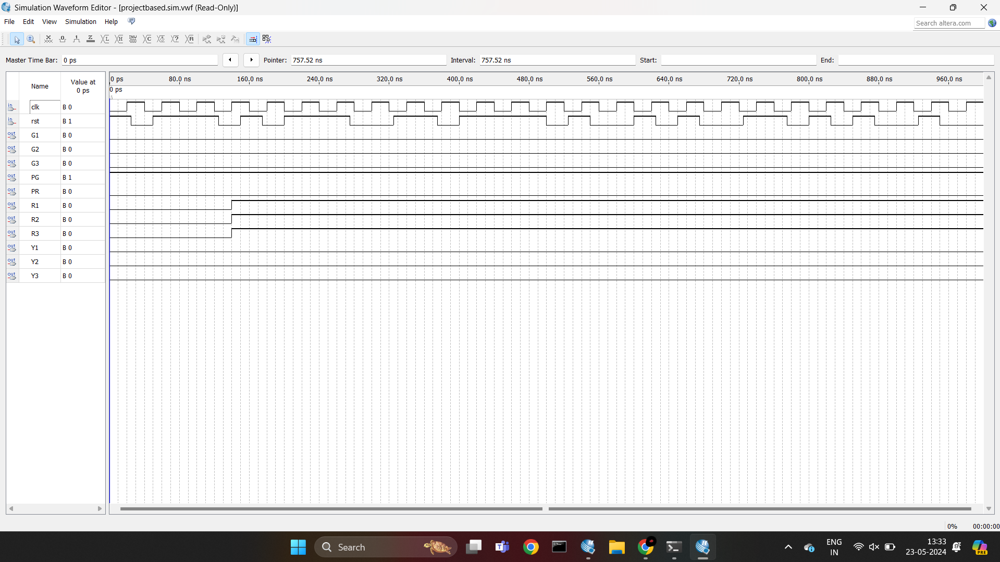

### Project-Based-Experiment

**AIM:**

To design and simulate the traffic light controller.

**SOFTWATE USED:**

Quartus II

**THEORY:**
	
     	Consider a controller for traffic at the intersection of three main roads.  

  


 The traffic signal for all the three main roads have equal priority and they remain red by default.

 In state 00,the traffic signals remains red for first five counts and yellow of road1 turns on for the next four counts.

 In state 01, the green of road1 turns on for first five counts and yellow of road1 and road2 turns on for next four4 counts of this state.
 
 In state 10, the traffic signal of road1 comes back to the red and that of road2 goes to green for tee first five counts.For the next four counts the traffic signal of road2 and road3 remains yellow.


 In state 11, the traffic signal of road2 comes back to the red and that of road3 goes to green for the first five counts.For the next four counts the traffic signal of road3 turns to yellow

 At the end of four states,the traffic signal of all the three roads come back to red.

**Task Assigned**

From the HDL code given formulate the correct code  to divert the traffic to path 1 direction and disable the control in other directions (Assume user is at MR3 spot)

**Procedure**

1.	Type the program in Quartus software.
2.	Compile and run the program.
3.	Generate the RTL schematic and save the logic diagram.
4.	Create nodes for inputs and outputs to generate the timing diagram.
5.	For different input combinations generate the timing diagram
   
**Program:**
```
Developed by : Sam Israel D
Reg. No       : 212222230128
```
```verilog
module projectbased(R1,R2,R3,G1,G2,G3,Y1,Y2,Y3,PR,PG,clk,rst);                  
output reg R1,R2,R3,G1,G2,G3,Y1,Y2,Y3,PR,PG;
input clk,rst;
reg [3:0]count;
reg [1:0]state = 2'b0;

always@(posedge clk)
begin
if(~rst)
begin
     R1 = 1'b1; G1 = 1'b0; Y1 = 1'b0;
		R2 = 1'b1; G2 = 1'b0; Y2 = 1'b0;
		R3 = 1'b1; G3 = 1'b0; Y3 = 1'b0;
     state=2'b00;
end
else 
 begin
  case(state)

    2'b00://SIGNAL AT SIGNAL LIGHTS ONE

          begin
			 
           if(count==4'b0101)
            begin
				G1 = 1'b0;
             R1 = 1'b0;
				 Y1 = 1'b1;
				 
            end
           if(count==4'b1001)
            begin
            G1 = 1'b1;
				Y1 = 1'b0; 
				state=2'b01;
            end
            else
            state=2'b00;
           end
          
    2'b01://SIGNAL AT SIGNAL LIGHTS TWO

          begin
          if(count==4'b0101)
           begin
              				Y1 = 1'b1; 
					G1 = 1'b0;
					R2 = 1'b0; 
					Y2 = 1'b1; 
					G2 = 1'b0;
           end
          if(count==4'b1001)
           begin
            R1 = 1'b1; 
					Y1 = 1'b0;
					Y2 = 1'b0; 
					G2 = 1'b1;
					state = 2'b10; 
           end
          else
           state=2'b01;
          end           
 
    2'b10://SIGNAL AT SIGNAL LIGHTS THREE
          begin
          if(count==4'b0101)
           begin
            Y2 = 1'b1; 
					G2 = 1'b0;
					R3 = 1'b0; 
					Y3 = 1'b1; 
					G3 = 1'b0;
           end
          if(count==4'b1001)
           begin
            R2 = 1'b1; 
				Y2 = 1'b0;
				Y3 = 1'b0; 
				G3 = 1'b1;
					state = 2'b11; 
           end
          else
           state=2'b10;
       end
    2'b11://ALL SIGNAL HIGH TO ALLOW PEDESTRIALS TO CROSS
    				begin      
				if(count==4'b0101)
           begin
			  Y1= 1'b0;
            Y3 = 1'b1; 
					G3 = 1'b0;
           end
          if(count==4'b1001)
           begin
			  Y1 =1'b0;
            R3 = 1'b1; 
					Y3 = 1'b0;
					state = 2'b00; 
           end
          else
           state=2'b11;
          end
       endcase
   end
end

always@(count,state)
begin
    if((state==2'b00)&&(count<=4'b1001))
     begin
       PR = 1'b0;
		  PG = 1'b1;
     end
   else
     begin
       PR = 1'b1;
		  PG = 1'b0;
     end
end

//always@(posedge clk_sec)
always@(posedge clk)
begin
	if(rst==1'b0)
      count=4'b0000;
   //else if(clk_sec)
	else if(clk)
     	 	begin
        		if(count[3:0]==4'b1001)
           	count[3:0]=4'b00000000;
				else
           		count[3:0]=count[3:0]+1;
     		end
end

endmodule

```

**RTL Schematic**


**Output Timing Waveform**



**Result:**

Thus, a traffic light controller is simulated successfully using Quartus Prime.


